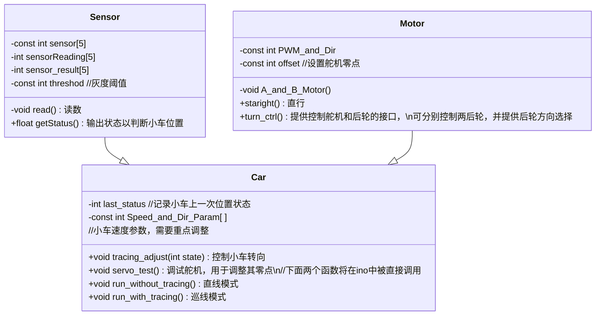
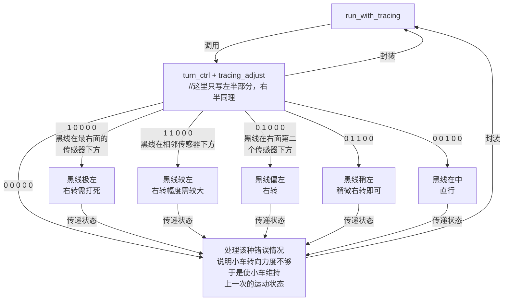
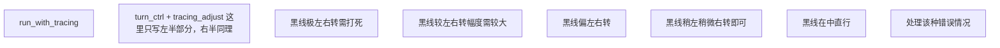
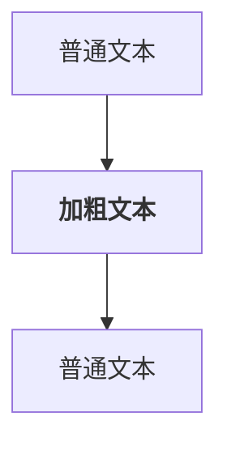

# TracingCar
工程实践课程大作业：巡线小车

由于使用面向对象的方法编写程序，故使用mermaid中的classDiagram构建程序框图。
请注意，该框图只展示了大致的逻辑，变量和函数名也并非一一对应。

若想具体了解可以直接查看代码(即car.hpp)，内部附有详细注释。

以下是控制程序逻辑框图：

``` mermaid
classDiagram
    Sensor --|> Car
    Motor --|> Car
    class Sensor{
        -const int sensor[5]
        -int sensorReading[5]
        -int sensor_result[5]
        -const int threshod //灰度阈值
        -void read() 读数
        +float getStatus() 输出状态以判断小车位置
    }
    class Motor{
        -const int PWM_and_Dir
        -const int offset //设置舵机零点
        
        -void A_and_B_Motor()
        +staright() 直行
        +turn_ctrl() 提供控制舵机和后轮的接口，\n可分别控制两后轮，并提供后轮方向选择
    }
    class Car{
        -int last_status //记录小车上一次位置状态
        -const int Speed_and_Dir_Param[ ] 
        //小车速度参数，需要重点调整
        +void tracing_adjust(int state) 控制小车转向
        +void servo_test() 调试舵机，用于调整其零点\n//下面两个函数将在ino中被直接调用
        +void run_without_tracing() 直线模式
        +void run_with_tracing() 巡线模式
    }
```

```mermaid
graph TD;
    Z[run_with_tracing]
    Y[处理该种错误情况
    说明小车转向力度不够
    于是使小车维持
    上一次的运动状态]
    A[turn_ctrl + tracing_adjust
    //这里只写左半部分，右半同理]
    B[黑线极左
    右转需打死]
    C[黑线较左
    右转幅度需较大]
    D[黑线偏左
    右转]
    E[黑线稍左
    稍微右转即可]
    F[黑线在中
    直行]
    A -->|1 0 0 0 0
    黑线在最右面的
    传感器下方| B
    A -->|1 1 0 0 0
    黑线在相邻传感器下方| C
    A -->|0 1 0 0 0
    黑线在右面第二
    个传感器下方| D
    A -->|0 1 1 0 0| E
    A -->|0 0 1 0 0| F
    Z -->|调用| A
    A -->|封装| Z
    A -->|0 0 0 0 0| Y
    B -->|传递状态|Y
    C -->|传递状态|Y
    D -->|传递状态|Y
    E -->|传递状态|Y
    F -->|传递状态|Y
    Y -->|封装| Z
```

```mermaid
graph TD;
    A[run_with_tracing]
    B[turn_ctrl + tracing_adjust 这里只写左半部分，右半同理]
    C[黑线极左右转需打死]
    D[黑线较左右转幅度需较大]
    E[黑线偏左右转]
    F[黑线稍左稍微右转即可]
    G[黑线在中直行]
    H[处理该种错误情况]
```

```mermaid
graph TD;
    A[普通文本] --> B[<b>加粗文本</b>]
    B --> C[普通文本]
```